# Machine Learning Operations

The goal of this project is to effectively configure a cloud-based machine learning production model, deploy it, and consume it using Azure ML Studio and SDK (pipelines).

The dataset is related to direct marketing campaigns of a banking institution. The task is to predict if the individual will subscribe to the bank service (bank term deposit). It's a classification task.

We first use Azure studio to create best model using Auto ML. After that, the best model is deployed. We then enable logging and application insights. Swagger documentation is also implemented. The deployed model endpoint is successfully tested.

The similar process is then followed using pipelines.

## Architectural Diagram

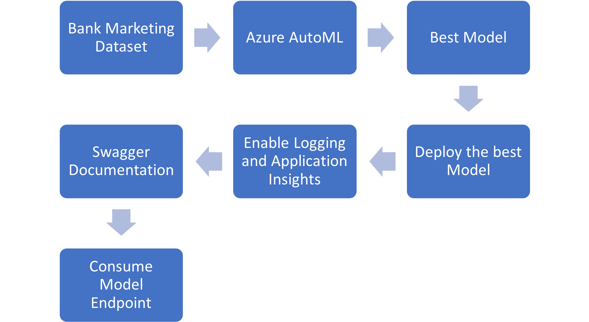

## How to improve the project in future

I would like to try different deep learning architecures to see the difference in accuracy. 

Also, I would like to focus on the different data augmentation techniques to improve accuracy.

If the data to train is huge, it will be better to run the pipelines in parallel using ParallelRunSteps. This might give us more exposure to different capabilities of Azure ML.

Another approach is to do feature engineering which might help in improving accuracy. 

It would also be very interesting to do more analysis of model endpoint by testing batch inferencing.

## Key Steps

### Step 1 - Authentication (skipped)

### Step 2 - Automated ML Experiment

1) Registered Dataset (Bank-marketing)

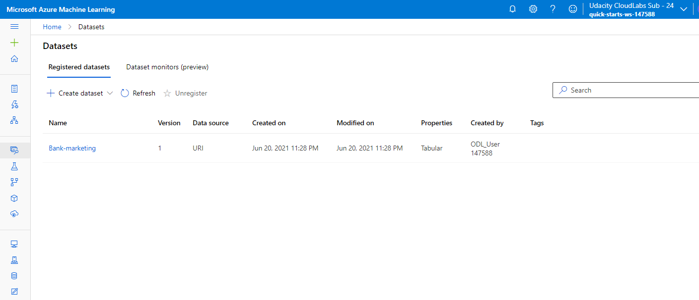

2) AutoML Experiment successfuly completed which was ran on a cpu compute cluster (Virtual machine size: Standard_DS12_v2 with minimum number of nodes=1).

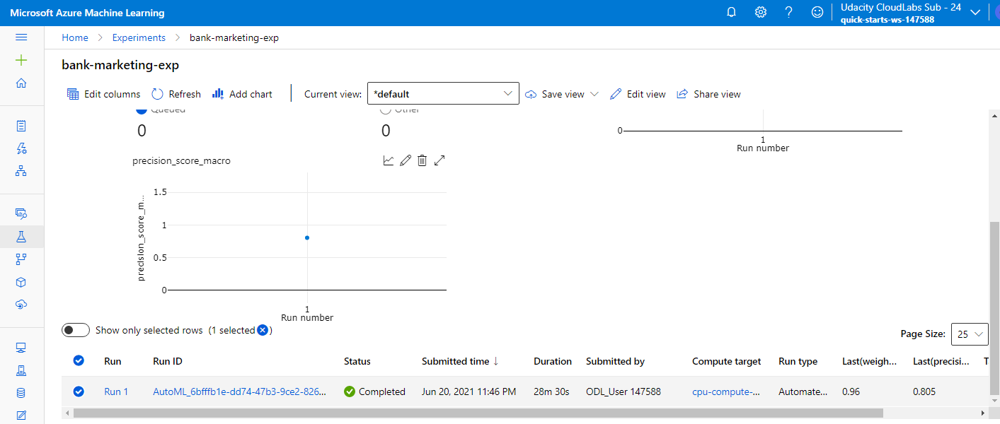

3) Best performing model is Voting Ensemble with an accuracy of 91.8%.

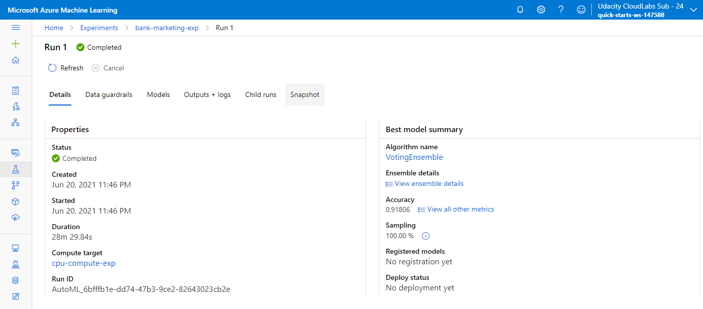

4) Following are the details of the best model 

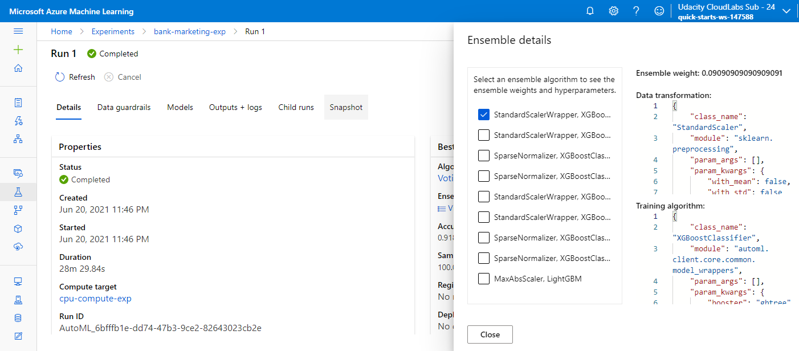

### Step 3 - Best Model Deployed - It will allow to interact with the HTTP API service and interact with the model by sending data over POST requests. 

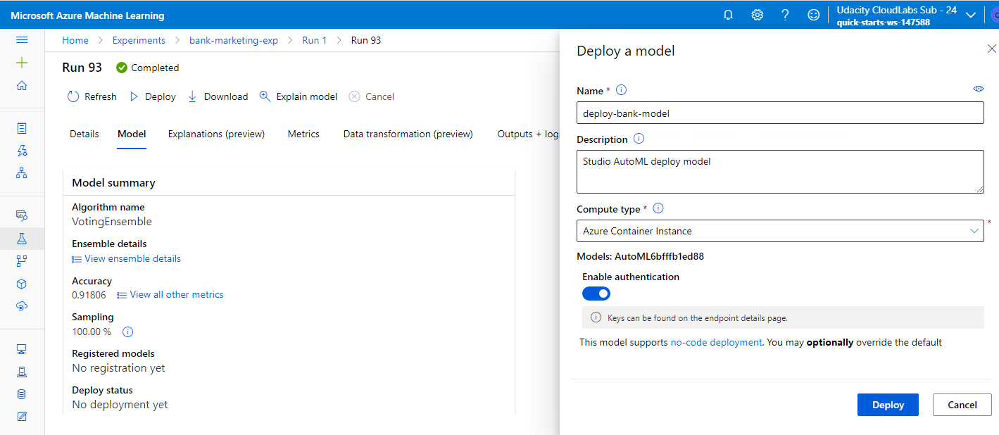

### Step 4 - Enable logging and Application Insights

Application Insights - Key base authentication is enabled (on Azure Container Instances service).
Authentication is crucial for the continuous flow of operations. Continuous Integration and Delivery system (CI/CD) rely on uninterrupted flows. Application Insights is a very useful tool to detect anomalies, visualize performance. In current case, It is enabled after the deployment. 

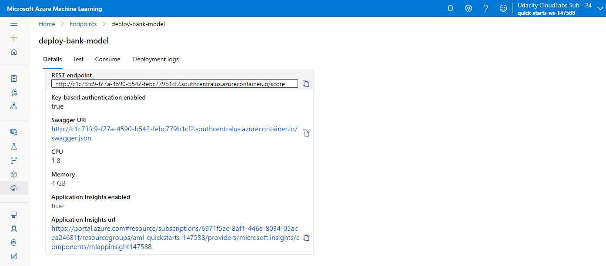


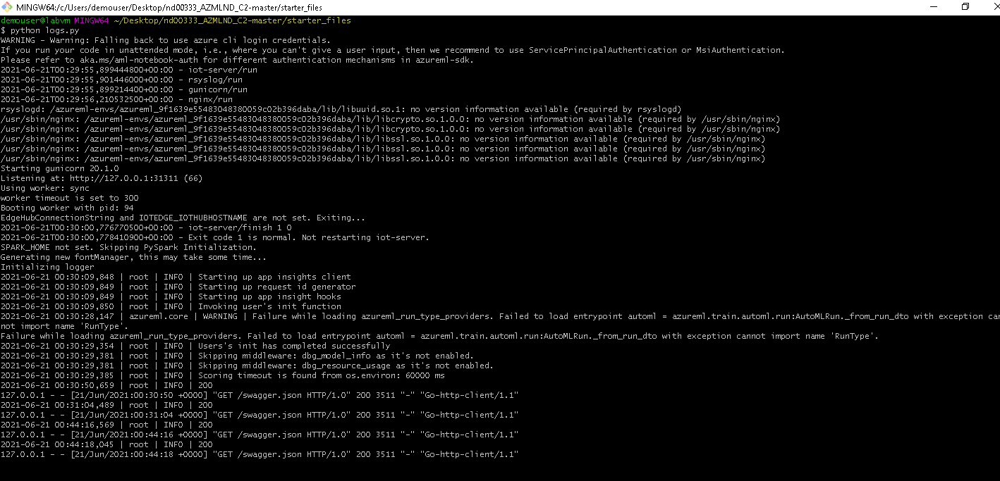

### Step 5 - Swagger Documentation

It makes it easy to see the details of the endpoint. It's a tool that helps build, document, and consume RESTful web services in Azure ML Studio. It also explains what types of HTTP requests that an API can consume, like POST and GET.


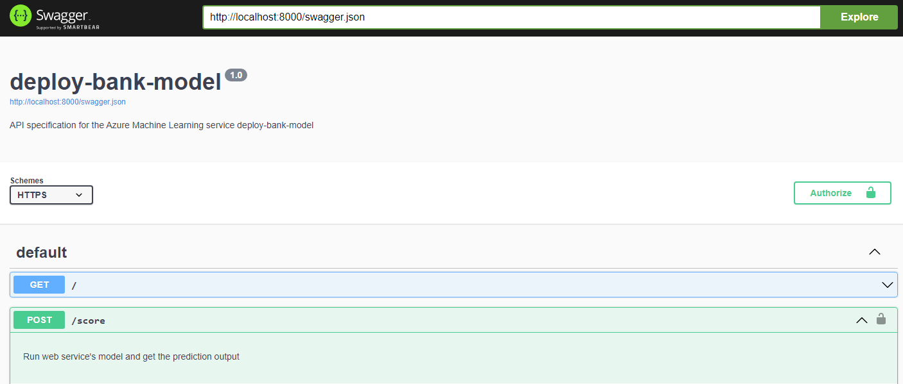
 

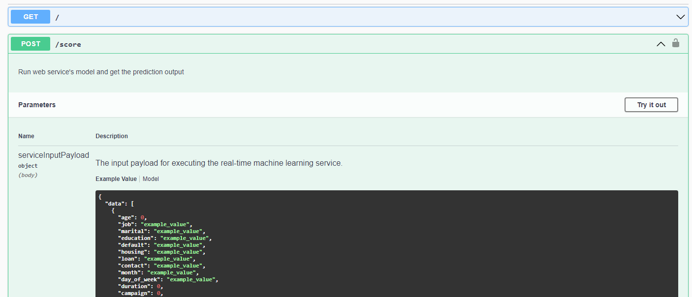


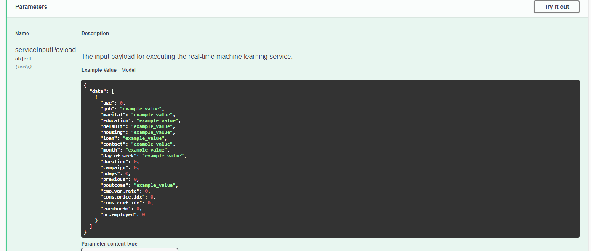


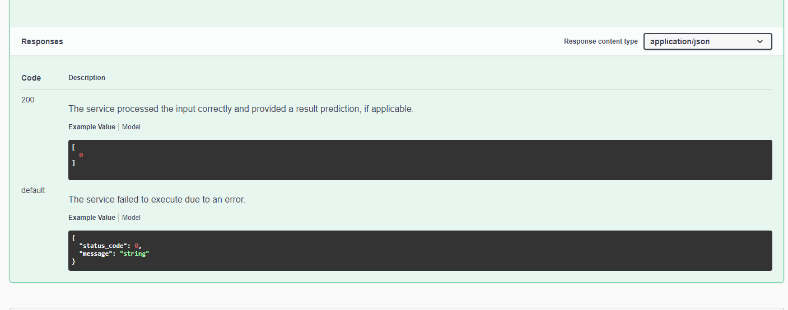

### Step 6 - Consume Model Endpoints 

Here we can observe the ouput. A deployed service can be consumed via an HTTP API. An HTTP API is a URL that is exposed over the network so that interaction with a trained model can happen via HTTP requests. An input request is through an HTTP POST request. HTTP POST is a request method that is used to submit data. HTTP GET is used to retrieve information from a URL. The APIs exposed by Azure ML use JSON. 

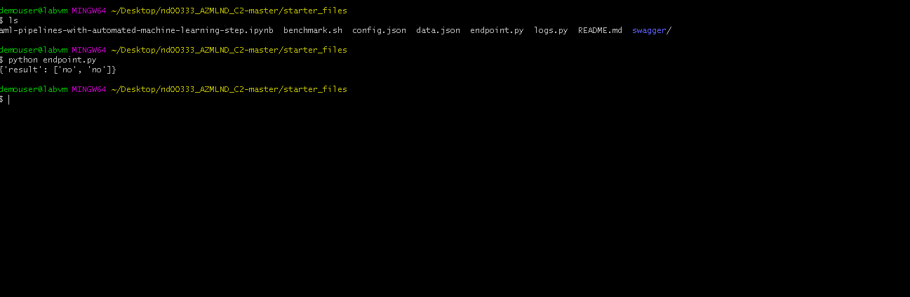

### Step 7 - Create, Publish and Consume a Pipeline

Pipelines are great way to automate workflows.

1) Pipeline has been created.

Below Python SDK class was used to create Pipeline. Aside from accepting a workspace and allowing multiple steps to be passed in, it uses a description that is useful to identify it later.

```
from azureml.pipeline.core import Pipeline
pipeline = Pipeline(
    description="pipeline_with_automlstep",
    workspace=ws,    
    steps=[automl_step])
```
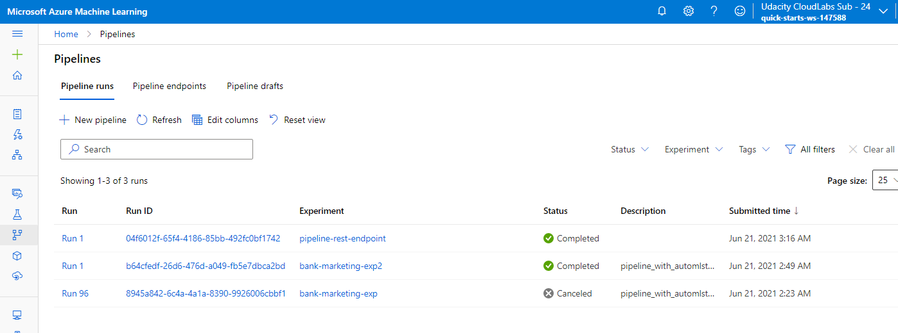

2) Pipeline Endpoint

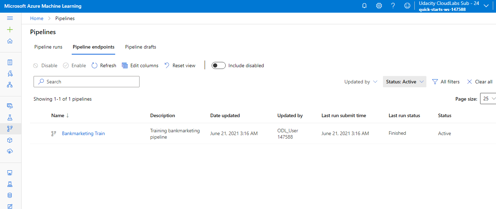

3) Bank marketing dataset with AutoML module

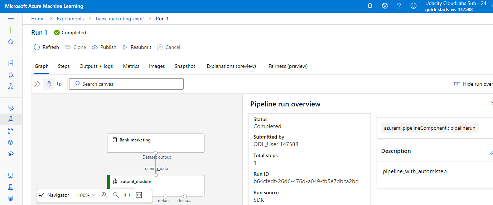

4) Published Pipeine overview showing a REST endpoint and status ACTIVE

Publishing a pipeline is the process of making a pipeline publicly available. When a Pipeline is published, a public HTTP endpoint becomes available, allowing other services, including external ones, to interact with an Azure Pipeline.


5) RunDetails widget

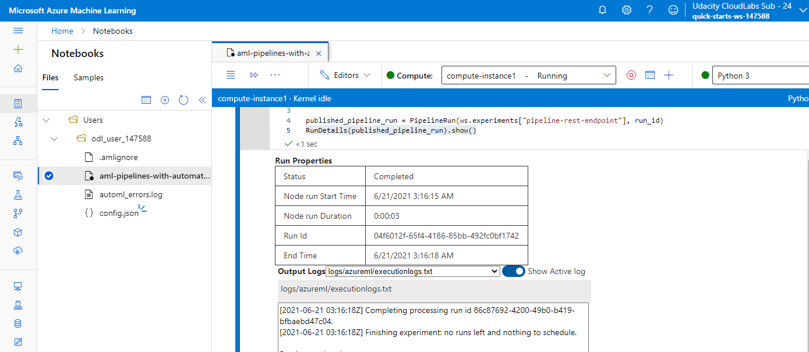

6) ML Studio


## Screen Recording

Video url: https://youtu.be/SN8rV-0b8Xg

