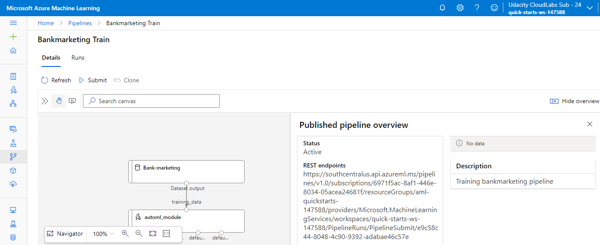

# Machine Learning Operations

The goal of this project is to effectively configure a cloud-based machine learning production model, deploy it, and consume it using Azure ML Studio and SDK (pipelines).

The dataset is related to direct marketing campaigns of a banking institution. The task is to predict if the individual will subscribe to the bank service (bank term deposit). It's a classification task.

We first use Azure studio to create best model using Auto ML. After that, the best model is deployed. We then enable logging and application insights. Swagger documentation is also implemented. The deployed model endpoint is successfully tested.

The similar process is then followed using pipelines.

## Architectural Diagram

## How to improve the project in future

I would like to try different deep learning architecures to see the difference in accuracy. Also, I would like to focus on the different data augmentation techniques to improve accuracy.      

## Key Steps

### Step 1 - Authentication (skipped)

### Step 2 - Automated ML Experiment

1) Registered Dataset (Bank-marketing)

2) AutoML Experiment successfuly completed 

3) Best performing model is Voting Ensemble 

4) Details of the best model 

### Step 3 - Best Model Deployed 

### Step 4 - Enable logging and Application Insights

1) Enable Application Insights

2) Enable logging

### Step 5 - Swagger Documentation

It makes it easy to see the details of the endpoint.

1)

2) 

3)

4)

### Step 6 - Consume Model Endpoints 

Here we can observe the ouput

### Step 7 - Create, Publish and Consume a Pipeline

1) Pipeline has been created

2) Pipeline Endpoint

3) Bank marketing dataset with AutoML module

4) Published Pipeine overview showing a REST endpoint and status ACTIVE

5) RunDetails widget

6) ML Studio

## Screen Recording

Video url: https://youtu.be/SN8rV-0b8Xg

